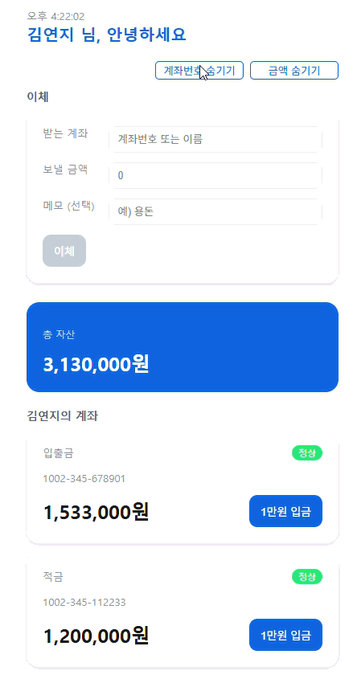
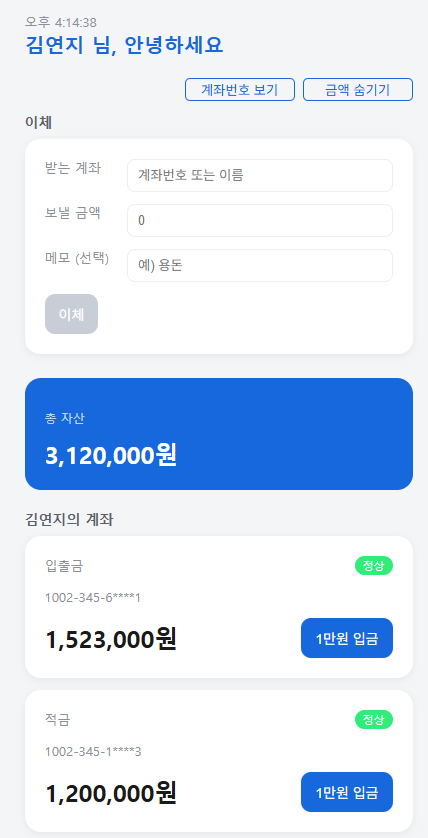
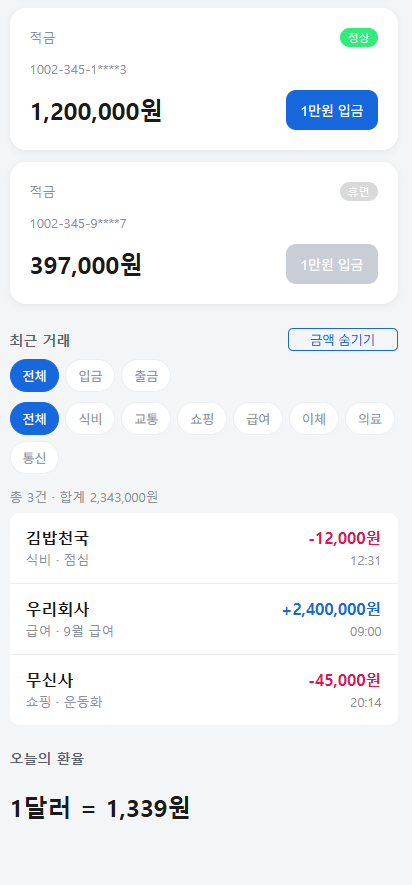

# WON Banking Mini

## 1. 소개

React로 만든 간단한 인터넷 뱅킹 화면입니다. 계좌별 잔액과 총자산을 확인하고, 1만원 입금과 이체를 수행할 수 있습니다. 최근 거래 내역을 입금·출금 및 카테고리별로 필터링하고, 계좌번호와 금액을 숨기거나 표시할 수 있습니다. 환율 영역에서는 `src/api/exchange.js`를 통해 환율 데이터를 불러오는 구조를 사용합니다.

배포 주소: https://woori-won-it-react-banking.vercel.app/

## 2. 화면



## 3. 실행 방법

### 설치

```bash
npm install
```

### 개발 서버 실행

```bash
npm run dev
```

### 테스트 실행

```bash
npm test
```

### 린트 실행

```bash
npm run lint
```

## 4. 폴더 구조

```text
src/
├─ api/
│  └─ exchange.js              # 환율 데이터 요청 함수
├─ assets/                     # 프로젝트 에셋
├─ components/
│  ├─ AccountCard.jsx          # 계좌 정보와 1만원 입금 버튼
│  ├─ Chip.jsx                 # 거래 내역 필터 칩
│  ├─ Clock.jsx                # 현재 시각 표시
│  ├─ ExcahgeRate.jsx          # 오늘의 환율 표시
│  ├─ Header.jsx               # 헤더
│  ├─ Panel.jsx                # 화면 영역 패널
│  ├─ StatusBadge.jsx          # 계좌 상태 표시
│  ├─ TotalBalance.jsx         # 총자산 표시
│  ├─ TransactionList.jsx      # 거래 내역과 필터
│  ├─ TransactionRow.jsx       # 거래 한 건 표시
│  ├─ TransferForm.jsx         # 이체 입력 폼
│  ├─ AccountCard.test.jsx     # AccountCard 테스트
│  ├─ Clock.test.jsx           # Clock 테스트
│  └─ Clock.test-plan.md       # Clock 테스트 계획
├─ contexts/
│  ├─ StatusContext.jsx        # 계좌 상태 Context
│  └─ UserContext.jsx          # 사용자 정보 Context
├─ data/
│  └─ mockData.js              # 계좌와 거래 내역 초기 데이터
├─ hooks/
│  └─ useFetch.js              # 비동기 데이터 요청 커스텀 훅
├─ utils/
│  ├─ format.js                # 금액·계좌번호 포맷 함수
│  └─ format.test.js           # 포맷 함수 테스트
├─ App.jsx                     # 전체 화면 구성과 주요 상태 관리
├─ App.css                     # App 화면 스타일
├─ index.css                   # 전역 스타일
├─ main.jsx                    # React 앱 시작점
└─ setupTests.js               # 테스트 환경 설정
```

## 5. 사용한 React 개념

### 컴포넌트

화면을 여러 컴포넌트로 나누어 구성했습니다. `App.jsx`에서 `Header`, `AccountCard`, `TransferForm`, `TotalBalance`, `TransactionList`, `ExchangeRate` 등을 조합합니다. 반복되는 계좌와 거래 화면은 각각 `AccountCard.jsx`, `TransactionRow.jsx`로 분리했습니다.

### props

부모 컴포넌트가 자식 컴포넌트에 데이터를 전달합니다. 예를 들어 `App.jsx`는 `AccountCard.jsx`에 `accountNo`, `balance`, `showBalance`, `onDeposit`을 전달하고, `TransactionList.jsx`에는 `transactions`, `hideAmount`를 전달합니다.

### state와 `useState`

`App.jsx`의 `useState`로 계좌 목록, 거래 내역, 계좌번호 표시 여부, 금액 표시 여부를 관리합니다. 입금이나 이체가 발생하면 `accountList`와 `transactions`가 함께 변경되고 화면이 다시 렌더링됩니다. `TransactionList.jsx`는 거래 유형과 카테고리 필터 상태를 별도로 관리합니다.

### `useEffect`

`Clock.jsx`는 `useEffect`로 1초마다 현재 시각을 갱신하는 `setInterval`을 등록하고, 컴포넌트가 사라질 때 `clearInterval`로 정리합니다. `hooks/useFetch.js`도 `useEffect`를 사용해 비동기 데이터 요청과 재요청을 처리합니다.

### `useContext`

`contexts/UserContext.jsx`와 `contexts/StatusContext.jsx`에서 Context를 만들고 `useContext` 기반의 `useUser`, `useStatus` 함수를 제공합니다. `App.jsx`는 `UserProvider`, `StatusProvider`로 값을 공급하며, `AccountCard.jsx`는 `useStatus`로 계좌 상태를 확인해 입금 버튼 활성화 여부를 결정합니다.

### 커스텀 훅

`hooks/useFetch.js`에 `useFetch` 커스텀 훅을 작성했습니다. 이 훅은 `data`, `loading`, `error`, `reload`를 반환해 비동기 요청 상태를 한 곳에서 관리할 수 있도록 합니다.

## 6. 테스트

Vitest와 React Testing Library를 사용합니다.

```bash
npm test
```

현재 테스트에서는 다음을 검사합니다.

- `utils/format.test.js`: 원화 금액 포맷과 계좌번호 마스킹
- `components/AccountCard.test.jsx`: 계좌번호 마스킹 표시
- `components/Clock.test.jsx`: 초기 시각 표시, 1초 후 시각 갱신, 언마운트 시 타이머 정리

`Clock.test.jsx`는 Given-When-Then 구조와 Vitest fake timers를 사용해 시간에 의존하지 않고 동작을 검증합니다.

## 7. 앞으로 할 것

- 실제 로그인과 사용자별 계좌 데이터 연동
- 목업 데이터 대신 서버 API를 사용한 계좌·거래 내역 조회
- 입금과 이체 내역을 새로고침 후에도 유지하도록 저장 기능 추가
- 이체 가능 금액 확인과 잔액 부족 안내
- 거래 내역 날짜·금액 검색 및 페이지네이션
- 환율 조회 실패와 로딩 상태 화면 보완
- 계좌 상태, 입금, 이체 흐름에 대한 테스트 추가
